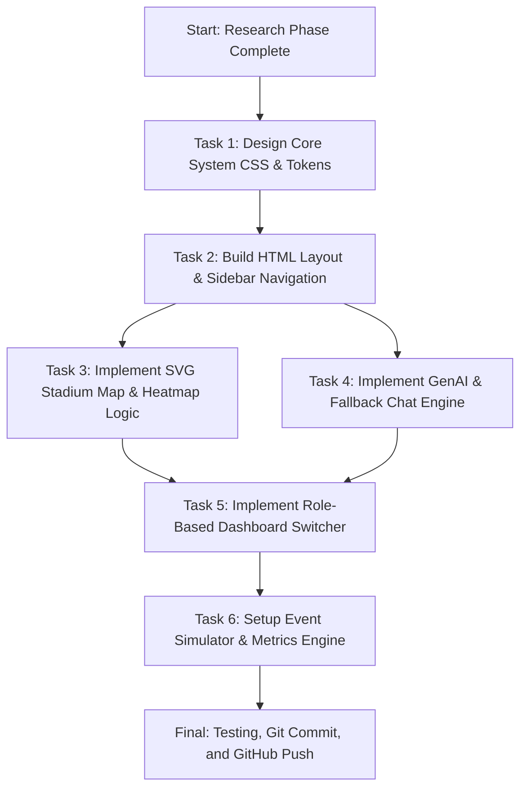

# 📊 Feature Prioritization & Gap Analysis Matrix

> **Task**: T-005 | **Agent**: Antigravity (Orchestrator) | **Model**: Claude Opus 4.6 (Thinking)  
> **Date**: 2026-07-07

---

## 1. Feature Analysis: Impact vs. Feasibility

To determine what belongs in our MVP (Minimum Viable Product) versus our stretch goals, we evaluate proposed features by multiplying **Impact** (1-5, based on how well it solves critical user pain points and aligns with hackathon rubrics) and **Feasibility** (1-5, based on the development effort required for a hackathon team).

### Priority Score Matrix (Impact × Feasibility)

| Feature | Target Audience | Impact (1-5) | Feasibility (1-5) | Priority Score | Tier |
| :--- | :--- | :---: | :---: | :---: | :---: |
| **GenAI Multilingual Fan Assistant** | Fans / Volunteers | 5 | 5 | **25** | **P0 (MVP)** |
| **Real-time Stadium map & Crowd Density Sim** | Fans / Staff / Org | 5 | 4 | **20** | **P0 (MVP)** |
| **Role-based Console Switcher (Fan/Staff/Org)** | All | 4 | 5 | **20** | **P0 (MVP)** |
| **Real-time Incident & Clean-up Alert Feed** | Staff / Volunteers | 4 | 4 | **16** | **P1 (Core)** |
| **Accessibility Panel (A11y modes & WCAG compliance)** | Fans / Volunteers | 4 | 4 | **16** | **P1 (Core)** |
| **Concession & Restroom Queue Tracker** | Fans | 4 | 4 | **16** | **P1 (Core)** |
| **Sustainability & Transit Hub Metrics** | Organizers / Fans | 3 | 4 | **12** | **P2 (Stretch)** |
| **Offline-first Ticket Wallet Fallback** | Fans | 4 | 3 | **12** | **P2 (Stretch)** |
| **AR Indoor Wayfinding Seating Overlay** | Fans | 4 | 2 | **8** | **P2 (Stretch)** |

---

## 2. MVP Scope Definition (P0 Features)

We will focus our immediate implementation on three high-scoring, high-alignment core features:

### 1. GenAI Multilingual Fan Assistant
*   **Purpose**: Immediate, personalized in-stadium help in 20+ languages.
*   **Capabilities**: Auto-detects user language; supports voice/text input; offers quick-action chips ("Find my seat", "Nearest Restroom", "Food options"). Integrates with a real Gemini API key (via settings) and falls back to a robust rule-based local simulator when no key is present.
*   **Hackathon Alignment**: High Impact on **Multilingual Assistance**, **Accessibility**, and **Product Impact** rubrics.

### 2. Interactive Stadium Map & Crowd Density Simulator
*   **Purpose**: Visualized density and bottleneck alerting for fans and venue organizers.
*   **Capabilities**: Lightweight interactive SVG-based stadium layout. Color-coded sectors showing real-time density (Safe → Busy → Evacuate). Dynamic simulator settings that trigger crowd congestion alerts and visual feedback on the map.
*   **Hackathon Alignment**: High Impact on **Crowd Management** and **Real-Time Decision Support** rubrics.

### 3. Role-Based Operations Console (Switcher)
*   **Purpose**: Unifies different stakeholder workflows into a single premium viewport.
*   **Capabilities**: Instant toggle between:
    *   *Fan View*: AI chatbot focus, transit info, queue times, and accessibility toggles.
    *   *Venue Staff View*: Live incident dispatch board (spills, security, medical calls) and queue alarms.
    *   *Organizer View*: Operational intelligence charts, crowd density control, and sustainability carbon tracker.
*   **Hackathon Alignment**: High Impact on **Usability**, **Operational Intelligence**, and **Aesthetics** rubrics.

---

## 3. Core Feature Specifications & Design

### 3.1 Onboarding & Personalization Flow
1.  **Language Select**: Dropdown with English, Spanish, French, Arabic, German, Hindi, Japanese, Portuguese, and Mandarin.
2.  **Accessibility Setup**: Toggle switches for *High Contrast Mode*, *Large Text Mode*, and *Accessible Routing (Wheelchair/Elevator Priority)*.
3.  **Role Designation**: Pick default role (Fan / Staff / Organizer). Can be switched at any time via the sidebar.

### 3.2 Visual & Aesthetic Framework
*   **Theme**: Deep command center dark-mode using a dark slate background (`#0B0F19`) and translucent glassmorphic card overlays (`backdrop-filter: blur(12px)`).
*   **Colors**: Neon emerald (`#00FF87`) for successful operations, electric cyan (`#00F0FF`) for tech telemetry, warning amber (`#FFB300`) for queue delays, and neon crimson (`#FF3860`) for active incidents.
*   **Fonts**: *Outfit* for headings/dashboard titles, *Inter* for chat and UI copy, and *JetBrains Mono* for tabular data and coordinates.

---

## 4. Finalized Tech Stack Recommendation

To ensure the best balance between development speed, visual excellence, portability, and zero-setup deployment for the hackathon presentation, we recommend:

| Layer | Technology | Rationale |
| :--- | :--- | :--- |
| **Frontend** | Vanilla HTML5, CSS3, and modern ES6+ JavaScript | Maximum environment portability. Eliminates dependency version mismatch and build tool overhead, running instantly in any browser. |
| **UI Styling** | Custom Vanilla CSS (Dark Command Theme) | Allows precise control over glassmorphism, glowing borders, custom scrollbars, and keyframe-based animations. |
| **GenAI API** | Google Gemini API (`gemini-2.5-flash` model) | Fast inference, robust multilingual capabilities, and clean client-side integration via native `fetch` requests (no heavy Node packages required). |
| **Local AI Fallback** | Regular expression intent matcher | Ensures the AI chatbot works perfectly out of the box with zero setup or API keys (no empty placeholders). |
| **Stadium Map** | Custom SVG Canvas | Ultra-lightweight vector rendering. Interactive mouse-hover/click states, responsive resizing, and dynamic color/fill modifications for crowd heatmaps. |
| **Telemetry Data** | Client-side Simulator Engine | Emulates real-time API push updates (Wi-Fi pings, queue wait sensors) using JavaScript `setInterval` loops. |

---

## 5. Implementation Roadmap

